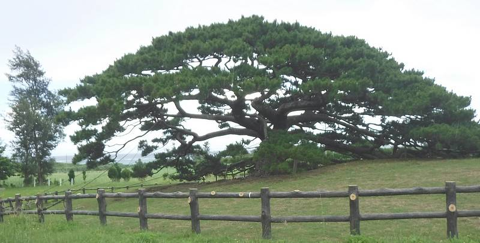

# Procrastination  

*by Robert Laurie*

[Go to Home](index)

[Go to Biography page](bio)

[UMUC Home page](https://www.asia.umuc.edu/)

[Class home page](http://islandman.org/um/ifsm201/index.html)
 
Procrastination seems to be my plight.  
With last minute anxiety, I search for insight.  
I have read many words that are not my own.  
There is no joy in memorizing another author's poem. 
 
I think of all those moments when I could have worked.  
But instead, I enjoyed the now and let the future lurk.  
Listening to nature's green song and talking with friends.   
I see no reason to make amends.  
 
Procrastination makes me feel alive.  
Not just another bee of the hive.  
Preparing five hours to talk for one.  
Is a waste of time for a child of the sun. 

